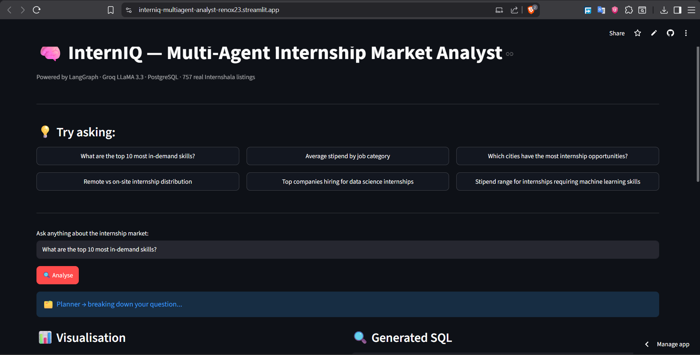
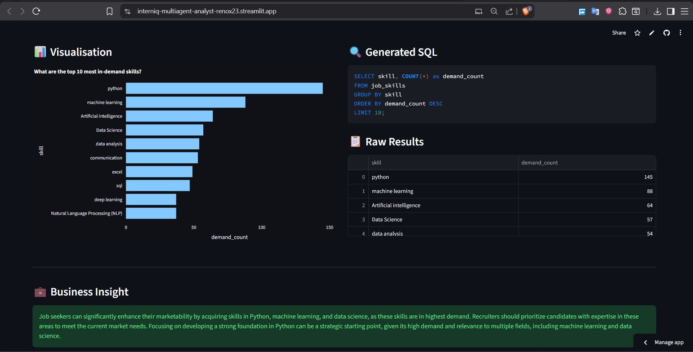
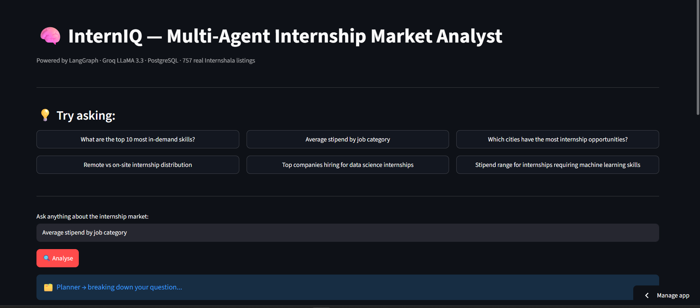
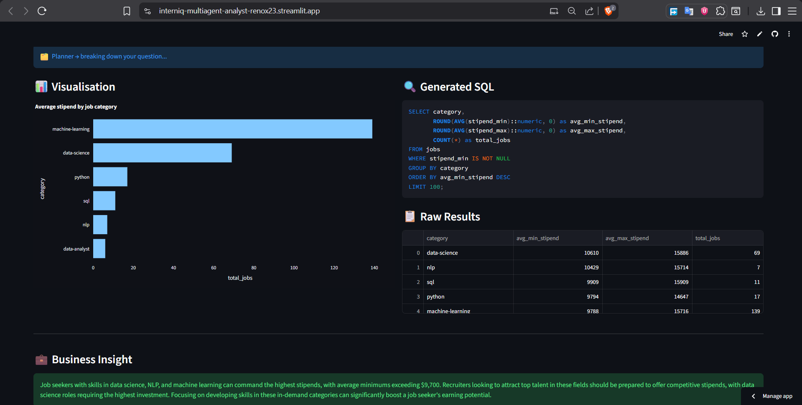
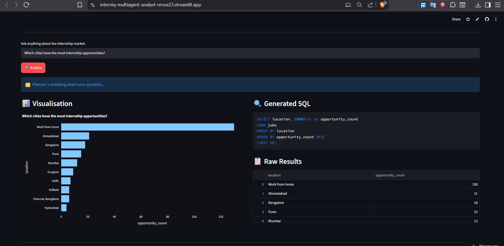
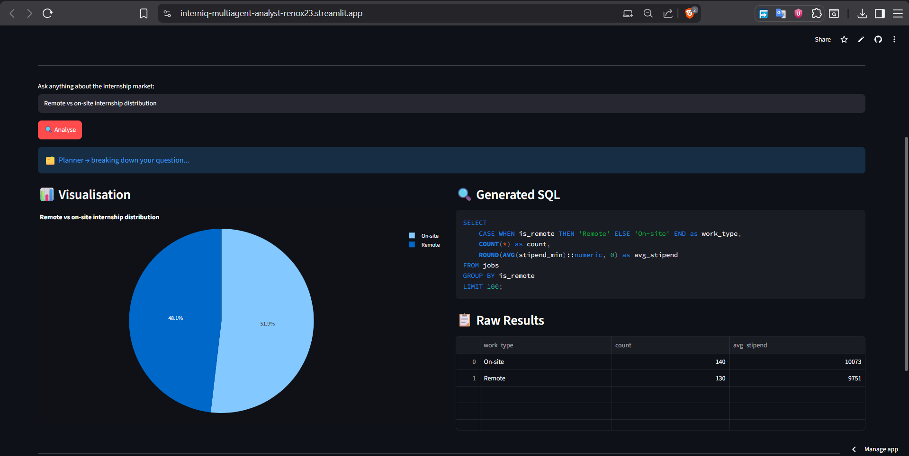
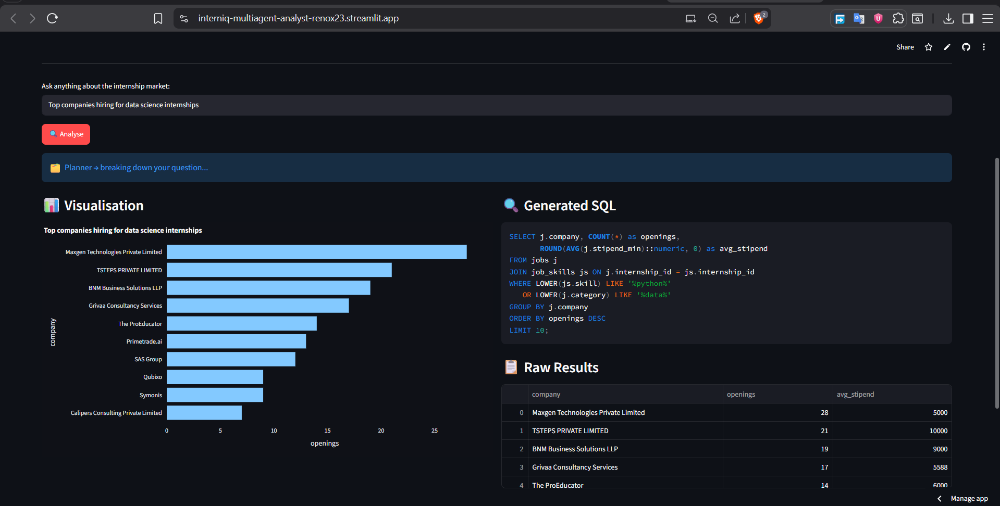
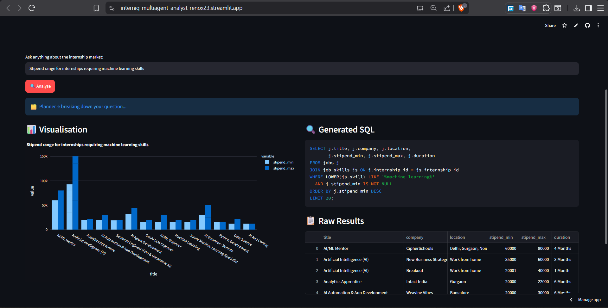

# 🧠 InternIQ — Multi-Agent Internship Market Analyst

> An autonomous analytics pipeline that answers natural language business questions
> about India's internship market using a 4-agent LangGraph architecture.

🌐 **Live App:** [https://interniq-multiagent-analyst-renox23.streamlit.app/](https://interniq-multiagent-analyst-renox23.streamlit.app/)

[](https://interniq-multiagent-analyst-renox23.streamlit.app/)
[](https://python.org)
[](https://langchain-ai.github.io/langgraph/)
[](https://groq.com)
[](https://neon.tech)

---

## 🔍 What It Does

InternIQ lets you ask plain English questions about India's internship market and get back
SQL queries, visualisations, and sharp business insights — automatically, with no human in the loop.

**Ask:** *"Which skills have the highest stipend in data science internships?"*
**Get:** Generated SQL → executed query → auto-chart → 3-sentence analyst insight

---

## 📸 Screenshots

### Overview


### Top In-Demand Skills


### Average Stipend by Category



### City-wise Opportunities


### Remote vs On-site Distribution


### Top Companies Hiring for Data Science


### Stipend Range for ML Internships


---

## 🏗️ Agent Architecture

```
User Question (Natural Language)
         │
         ▼
  ┌─────────────┐
  │   Planner   │  Initialises state, sets context
  └──────┬──────┘
         │
         ▼
  ┌─────────────┐
  │  SQL Agent  │  Few-shot prompted LLM → generates + executes SQL
  └──────┬──────┘
         │ (results)
         ▼
  ┌─────────────┐
  │  Viz Agent  │  Auto-selects chart type → renders Plotly figure
  └──────┬──────┘
         │
         ▼
  ┌──────────────┐
  │ Insight Agent│  LLM synthesises 2-3 sentence business insight
  └──────┬───────┘
         │
         ▼
   Streamlit UI  (SQL + Chart + Insight)
```

Built with **LangGraph StateGraph** — each agent is a typed node passing a shared
`AgentState` dict, with conditional edges for error handling.

---

## 📊 Dataset

- **Source:** Scraped from Internshala (proprietary, not publicly available)
- **Size:** 270 internship listings · 1,339 skill tags
- **Schema:**
  - `jobs` — title, company, location, stipend\_min, stipend\_max, duration, is\_remote, category
  - `job\_skills` — internship\_id, skill
- **Hosted on:** Neon Serverless PostgreSQL

> This is not a tutorial dataset. The data was scraped, cleaned, and loaded
> specifically for this project — making the insights genuinely novel.

---

## ⚡ Tech Stack

| Layer | Technology |
|---|---|
| Agent Orchestration | LangGraph (StateGraph) |
| LLM | Groq · LLaMA 3.3 70B Versatile |
| LLM Framework | LangChain |
| SQL Prompting | Few-shot prompt engineering |
| Database | PostgreSQL (Neon serverless) |
| Visualisation | Plotly Express |
| Frontend | Streamlit |
| Deployment | Streamlit Cloud |

---

## 💡 Sample Questions

```
What are the top 10 most in-demand skills?
Average stipend by job category
Which cities have the most internship opportunities?
Remote vs on-site internship distribution
Top companies hiring for data science internships
Stipend range for internships requiring machine learning skills
```

---

## 🗂️ Project Structure

```
interniq-multiagent-analyst/
├── agents/
│   ├── sql_agent.py       # LLM-powered SQL generation + execution
│   ├── viz_agent.py       # Auto chart type selection + Plotly rendering
│   └── insight_agent.py   # Business insight generation
├── graph/
│   └── workflow.py        # LangGraph StateGraph pipeline
├── db/
│   └── connection.py      # SQLAlchemy + Streamlit secrets handler
├── prompts/
│   └── few_shot.py        # Schema context + few-shot SQL examples
├── assets/                # Screenshots
├── app.py                 # Streamlit UI
└── requirements.txt
```

---

## 🚀 Run Locally

```bash
git clone https://github.com/RenoX23/interniq-multiagent-analyst.git
cd interniq-multiagent-analyst
python -m venv venv && source venv/Scripts/activate
pip install -r requirements.txt
```

Create `.env`:
```env
GROQ_API_KEY=your_groq_key
DB_HOST=your_postgres_host
DB_PORT=5432
DB_NAME=your_db
DB_USER=your_user
DB_PASSWORD=your_password
```

```bash
streamlit run app.py
```

---

## 📌 Key Findings from the Data

- **Python** is the #1 demanded skill — 64% more demand than the next skill (Machine Learning)
- **Bangalore** dominates internship volume; remote opportunities carry a stipend premium
- **Data Science + ML** roles offer the widest stipend variance — high upside for skilled candidates
- Most internships cluster in the **₹5,000–15,000/month** range with outliers above ₹30,000

---

## 👤 Author

**Renold Stephen** — M.Tech CS
Microsoft Learn Student Ambassador · Published Researcher (IJIRT 2025)

[](https://github.com/RenoX23)
